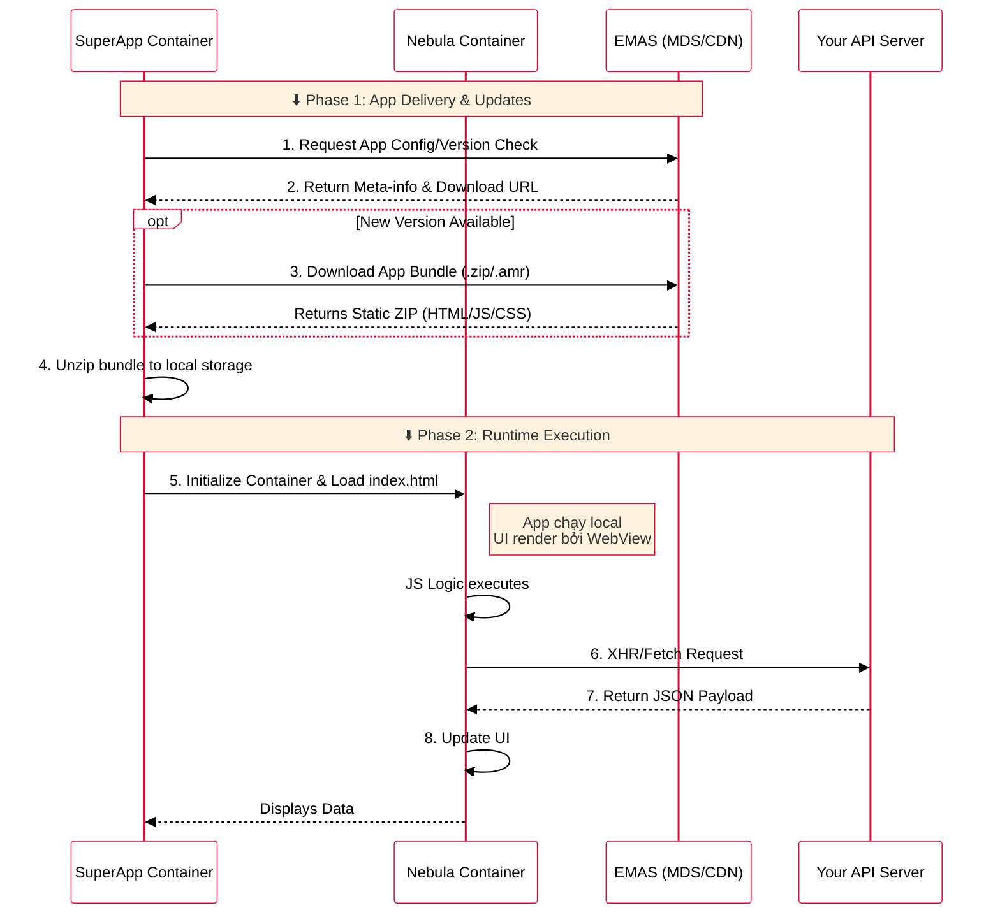
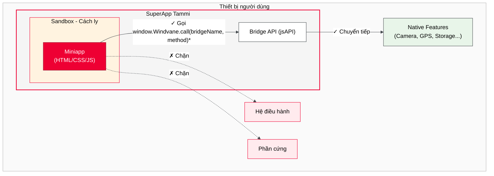

# Cách thức hoạt động

Quy trình tải và thực thi miniapp được chia làm hai giai đoạn chính:

## Giai đoạn 1: App Delivery & Updates

SuperApp Container yêu cầu thông tin cấu hình và phiên bản từ EMAS (MDS/CDN). Nếu có phiên bản mới, SuperApp sẽ tải về gói miniapp dưới dạng file nén (`.zip`/`.amr`) và giải nén vào bộ nhớ thiết bị.

## Giai đoạn 2: Runtime Execution (Offline-First SPA)

Miniapp được giải nén và thực thi trong môi trường **Nebula Container** (WebView/JS Runtime). Khi miniapp chạy, các logic JavaScript có thể thực hiện các yêu cầu XHR/Fetch trực tiếp đến API Server của đối tác, đảm bảo dữ liệu và logic nghiệp vụ được xử lý độc lập.



:::tip Offline-First
Vì bundle đã được tải về và lưu trên thiết bị, miniapp có thể khởi động ngay lập tức mà không cần chờ tải từ mạng. Chỉ các API call đến backend mới cần kết nối internet.
:::

## Môi trường Sandbox

Miniapp chạy trong một **sandbox kín** — môi trường cách ly hoàn toàn với hệ thống bên ngoài:



### Tại sao cần Sandbox?

| Lý do         | Giải thích                                                                 |
| ------------- | -------------------------------------------------------------------------- |
| **Bảo mật**   | Miniapp không thể truy cập dữ liệu nhạy cảm của thiết bị hoặc các app khác |
| **Ổn định**   | Lỗi trong miniapp không ảnh hưởng đến SuperApp hay hệ thống                |
| **Kiểm soát** | SuperApp quản lý được những gì miniapp có thể làm                          |

### Giới hạn của Sandbox

Do chạy trong sandbox, miniapp **không thể**:

- Truy cập trực tiếp file system, contacts, hay phần cứng
- Chạy background khi người dùng thoát khỏi miniapp
- Giao tiếp với các app khác trên thiết bị
- Vượt quá giới hạn dung lượng bundle và storage

**Mọi tương tác với bên ngoài đều phải đi qua Bridge API (jsAPI)** — lớp trung gian do SuperApp cung cấp và kiểm soát.

## Giao tiếp qua Bridge API (jsAPI)

Bridge API (jsAPI) là **cầu nối duy nhất** giữa miniapp và native layer:

```javascript
window.WindVane.call(
  "wv", // module
  "getAuthCode", // method
  { scopes: ["USER_NAME"] }, // params
  function (res) {
    // success callback
    console.log("Auth code:", res.code);
  },
  function (e) {
    // fail callback
    console.error("Failure:", JSON.stringify(e));
  }
);
```

**Luồng xử lý:**

1. Miniapp gọi `WindVane.call()` với module, method và params
2. Bridge chuyển request sang native code của SuperApp
3. Native code thực thi (yêu cầu quyền nếu cần)
4. Kết quả trả về qua callback `success` hoặc `fail`
