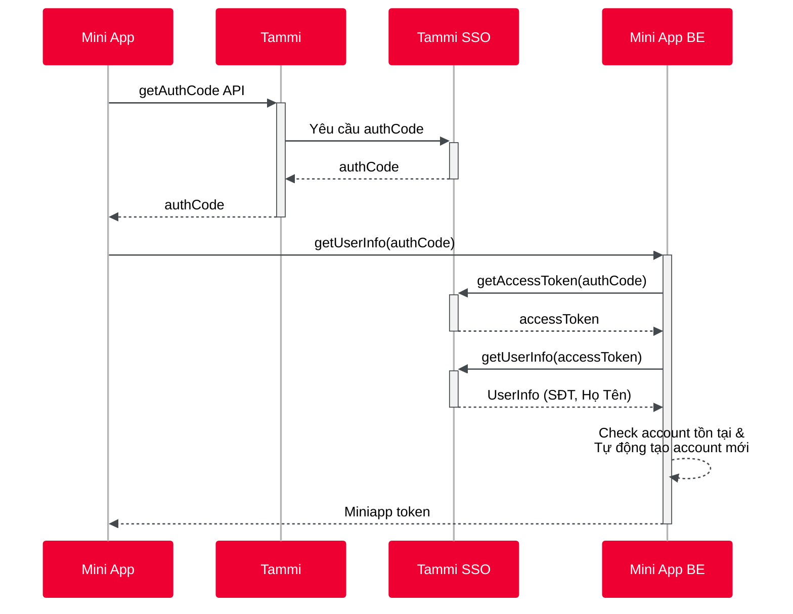

# Cách thức hoạt động

Tammi SSO là giải pháp xác thực tập trung. Tammi cung cấp một cách để miniapp lấy thông tin và xác thực danh tính user sau khi user đồng ý (consent). Miniapp sẽ khai thác thông tin đó để đối chiếu, liên kết tài khoản, hoặc tạo tài khoản mới.

## Tổng quan luồng SSO

## Chi tiết từng bước

### Bước 1-4: Frontend lấy Auth Code

**Frontend** (hay còn gọi là **front channel** / **unsafe channel**) là kênh để miniapp gọi và lấy `authCode`.

:::info Lưu ý quan trọng
`authCode` **không có giá trị xác thực**. Nó chỉ đại diện cho việc user đồng ý cung cấp dữ liệu cho miniapp. Vì `authCode` được truyền qua Frontend (unsafe channel), nên nó chỉ đại diện cho **consent** của user.
:::

`authCode` còn đại diện cho **scope dữ liệu** mà user đồng ý cho miniapp khai thác (ví dụ: số điện thoại, họ tên, email...).

### Bước 5-8: Backend đổi Access Token và lấy User Info

**Backend** (hay còn gọi là **back channel** / **safe channel**) là kênh để validate user consent và lấy dữ liệu từ server Tammi.

Để làm được điều này, backend cần:

1. **Client ID / Secret**: Cặp khóa để xác minh danh tính backend này thuộc về một miniapp nhất định
2. **Auth Code**: Đại diện cho consent của user (lấy từ Frontend)

Kết hợp hai yếu tố trên, backend có thể đổi lấy `accessToken` của user. Token này mới có giá trị để lấy dữ liệu user.

### Bước 9: Xử lý tài khoản

Sau khi có thông tin user (SĐT, Họ Tên...), backend sẽ:

- Kiểm tra tài khoản đã tồn tại trong hệ thống miniapp chưa
- Nếu chưa có: Tự động tạo tài khoản mới
- Nếu đã có: Liên kết với tài khoản hiện có

### Bước 10: Trả về Miniapp Token

Backend trả về token của miniapp cho Frontend. Token này dùng để duy trì phiên đăng nhập của user trong miniapp.

## Tóm tắt

| Thành phần | Vai trò | Kênh |
|------------|---------|------|
| Frontend | Lấy `authCode` (consent) | Unsafe channel |
| Backend | Đổi `accessToken`, lấy user info | Safe channel |
| Client ID/Secret | Xác minh danh tính miniapp | - |
| Auth Code | Đại diện cho user consent | - |
| Access Token | Có giá trị lấy dữ liệu user | - |
