# Triển khai Frontend

Frontend chịu trách nhiệm lấy `authCode` từ Tammi - đại diện cho việc user đồng ý chia sẻ thông tin với miniapp.

## Luồng xử lý

```mermaid
%%{init: {
  'theme': 'base',
  'themeVariables': {
    'primaryColor': '#EE0033',
    'primaryTextColor': '#44494D',
    'primaryBorderColor': '#EE0033',
    'lineColor': '#44494D',
    'secondaryColor': '#F2F2F2',
    'tertiaryColor': '#B5B4B4'
  }
}}%%
flowchart LR
    A["User mở app"] --> B["Gọi getAuthCode"]
    B --> C["User consent"]
    C --> D["Nhận authCode"]
    D --> E["Gửi tới Backend"]
    E --> F["Nhận miniapp token"]

    style A fill:#F2F2F2,color:#000000
    style B fill:#EE0033,color:#FFFFFF
    style C fill:#F2F2F2,color:#000000
    style D fill:#EE0033,color:#FFFFFF
    style E fill:#F2F2F2,color:#000000
    style F fill:#EE0033,color:#FFFFFF
```



## Điều kiện tiên quyết

| Yêu cầu | Mô tả |
|---------|-------|
| Môi trường miniapp | Code phải chạy trong Tammi app (có WindVane) |
| App ID | ID của miniapp (được cấp khi đăng ký) |

:::warning Không hoạt động ở local
`getAuthCode` chỉ hoạt động khi miniapp chạy trong Tammi. Không hoạt động ở chế độ local preview.
:::

## Gọi getAuthCode

Sử dụng WindVane API để lấy auth code:

```typescript
window.WindVane.call(
  "wv",
  "getAuthCode",
  { appId: "your-app-id", scopes: ["auth_user"] },
  (result) => {
    // Thành công: result.authCode
    sendToBackend(result.authCode);
  },
  (error) => {
    // Thất bại: xử lý lỗi
  }
);
```

### Tham số

| Tham số | Kiểu | Bắt buộc | Mô tả |
|---------|------|----------|-------|
| `appId` | `string` | Có | ID của miniapp |
| `scopes` | `string[]` | Có | Quyền truy cập dữ liệu |

### Scopes hỗ trợ

| Scope | Dữ liệu nhận được |
|-------|-------------------|
| `auth_user` | Số điện thoại, họ tên |

## Gửi authCode tới Backend

Sau khi có `authCode`, gửi tới backend để đổi lấy miniapp token:

```typescript
const response = await fetch("/api/auth/login", {
  method: "POST",
  headers: { "Content-Type": "application/json" },
  body: JSON.stringify({ authCode }),
});

const { token } = await response.json();
// Lưu token để sử dụng cho các request tiếp theo
```

## Xử lý lỗi thường gặp

| Lỗi | Nguyên nhân | Xử lý |
|-----|-------------|-------|
| WindVane not available | Không chạy trong Tammi | Kiểm tra môi trường |
| No auth code returned | User từ chối consent | Hiển thị thông báo phù hợp |
| Invalid appId | App ID không đúng | Kiểm tra lại cấu hình |

## Tiếp theo

Backend cần xử lý `authCode` để lấy thông tin user. Xem [Triển khai Backend](./3_backend.mdx).
