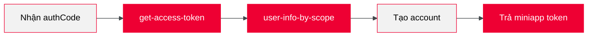

import HoTro from "@site/docs/_shared/_ho_tro.mdx";

# Triển khai Backend

Backend chịu trách nhiệm đổi `authCode` thành thông tin user thực tế, sau đó tạo token cho miniapp.

## Điều kiện tiên quyết

Trước khi bắt đầu, liên hệ đầu mối để nhận:

| Credential        | Mô tả                   |
| ----------------- | ----------------------- |
| **Client ID**     | Định danh miniapp       |
| **Client Secret** | Khóa bí mật để xác thực |

<HoTro />

:::caution Bảo mật
**Client Secret** không được để lộ ở frontend hoặc commit vào source code.
:::

## Luồng xử lý



## API 1: Get Access Token

Đổi `authCode` lấy `accessToken`.

|              |                                                                |
| ------------ | -------------------------------------------------------------- |
| **Endpoint** | `POST https://api.tammi.vn/api/v1/auth/oauth/get-access-token` |
| **Auth**     | Basic Auth (username = client_id, password = client_secret)    |

**Request:**

```json
{
  "authCode": "MpkM4h8d16FvgMrYfehTwI4141JMYLP1v1zojmzEqMY"
}
```

**Response:**

```json
{
  "success": true,
  "data": {
    "access_token": "eyJhbGciOiJSUzI1NiIsInR5cCI6IkpXVCJ9...",
    "expires_in": 432000,
    "token_type": "Bearer",
    "scope": "USER_NAME profile USER_PHONE_NUMBER"
  }
}
```

## API 2: Get User Info

Lấy thông tin user từ `accessToken`.

|              |                                                           |
| ------------ | --------------------------------------------------------- |
| **Endpoint** | `GET https://api.tammi.vn/api/v1/user/user-info-by-scope` |
| **Auth**     | Bearer Token (access_token từ API 1)                      |

**Response:**

```json
{
  "success": true,
  "data": {
    "username": "Hotaru",
    "phoneNumber": "84869472303"
  }
}
```

## Xử lý tiếp theo

Sau khi có thông tin user, backend cần:

1. **Kiểm tra account** - User đã tồn tại trong hệ thống chưa (theo phoneNumber)
2. **Tạo/liên kết account** - Tạo mới hoặc liên kết với account có sẵn
3. **Tạo miniapp token** - JWT hoặc session token để FE duy trì đăng nhập
4. **Trả về FE** - Gửi token về cho frontend

## Tiếp theo

Sau khi hoàn thành SSO, xem [Bước tiếp theo](./4_next_step.md) để tiếp tục phát triển miniapp.
