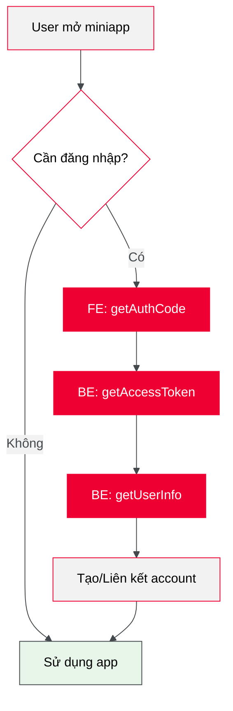

# Bước tiếp theo

Sau khi hoàn thành SSO, bạn đã có thể xác thực user trong miniapp.

## Tổng kết luồng SSO

## Bridge API

Tiếp theo, tìm hiểu Bridge API để tương tác với tính năng native của Tammi:

| Khả năng       | Ví dụ                         |
| -------------- | ----------------------------- |
| **Phần cứng**  | Camera, GPS, Bluetooth        |
| **Giao diện**  | Navigation bar, Toast, Dialog |
| **Thanh toán** | Cổng thanh toán Tammi         |
| **Chia sẻ**    | Share lên mạng xã hội         |

[Xem tài liệu Bridge API](/bridge-api)
