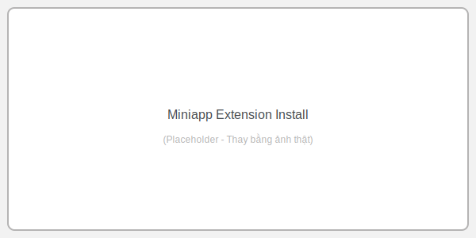

# Thiết lập môi trường

Tải và cài đặt Node.js phiên bản LTS từ [nodejs.org](https://nodejs.org).

Sau khi cài đặt, kiểm tra bằng terminal nhw sau:

Phiên bản nodejs

```bash title="Terminal"
node --version
# v18.x.x hoặc cao hơn
```

Phiên bản npm

```bash title="Terminal"
npm --version
# 9.x.x hoặc cao hơn
```

:::warning Chỉ hỗ trợ npm
Miniapp **chỉ hỗ trợ npm** làm package manager. Không sử dụng yarn, pnpm hay bun để cài đặt dependencies.
:::

## 2. Cài đặt Miniapp Extension

Cài đặt **Miniapp Extension** của Viettel trong VSCode:

1. Mở VSCode
2. Vào **Extensions** (Ctrl+Shift+X)
3. Tìm kiếm "Miniapp Viettel"
4. Nhấn **Install**



:::tip Không cần đăng nhập
Extension sẽ yêu cầu đăng nhập, nhưng **phát triển local không cần đăng nhập**. Bạn có thể bỏ qua popup và tiếp tục sử dụng.
:::

## 3. Chuẩn bị thiết bị Android

Bạn cần một trong hai:

| Tùy chọn             | Mô tả                                                          |
| -------------------- | -------------------------------------------------------------- |
| **Thiết bị thật**    | Kết nối qua USB, bật **USB Debugging** trong Developer Options |
| **Android Emulator** | Sử dụng Android Studio Emulator hoặc công cụ tương tự          |

## Framework được hỗ trợ

| Hỗ trợ đầy đủ | Hỗ trợ có giới hạn         |
| ------------- | -------------------------- |
| React         | Next.js (Client-side mode) |
| Vue           | Nuxt (Client-side mode)    |
| Web H5 thuần  | Angular                    |

:::info Tại sao có giới hạn?
Miniapp là **SPA tĩnh** chạy trong sandbox. Các framework yêu cầu server-side rendering (SSR) cần chuyển sang client-side mode để tương thích.
:::

## Tiếp theo

Môi trường đã sẵn sàng. Tiếp tục với [Phát triển Miniapp](./phat_trien_miniapp) để tạo miniapp đầu tiên.
